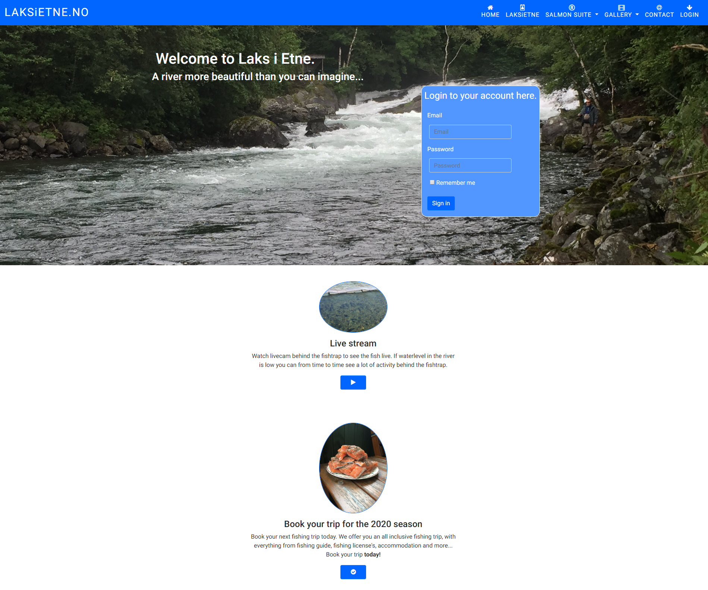

# LaksiEtne.no
As my first milestone project I chose to develop a site for my nearly local salmon river. The site offers information about booking, water levels, link to live cam behind the fish trap and more.

Link to the project: <a href="https://weekend79.github.io/salmon/index.html">Click here</a>



### For developers
Clone the site locally:
```sh
$ git clone https://github.com/weekend79/salmon.git
$ cd salmon
```

### Features

- [x] Upload photo of your fish in the app
- [x] Registration of fishes catched
- [x] Check water levers
- [x] Link to live cam behind the fish trap
- [x] Book your next trip to Etne
- [x] Picture gallery 

### Built with

* [Bootstrap](https://getbootstrap.com/docs/4.3/getting-started/introduction/) - The web framework used
* [CSS3](http://www.css3.info/) - Stylesheet
* [FontAwsome](https://fontawesome.com/how-to-use/on-the-web/referencing-icons/basic-use) - Used to add icons to the site
* [GoogleScripts](https://developers.google.com/apps-script/) - Used to add charts to the site

### Contributing
I would like to say thank you to Reuben Ferrante my mentor for helping me fix some important issues with the menu and some other things. 

### Author

* **Morten Viken** - *Initial work* - [weekend79](https//github.com/weekend79)

